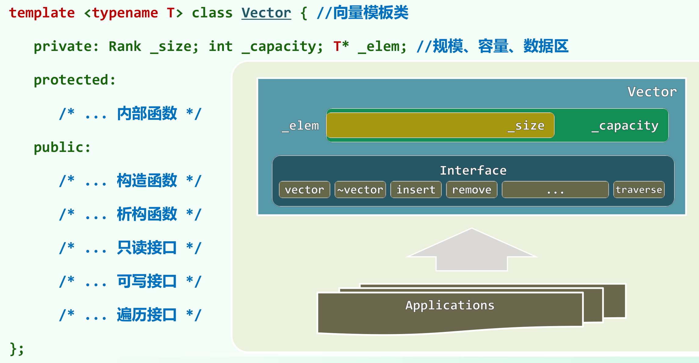
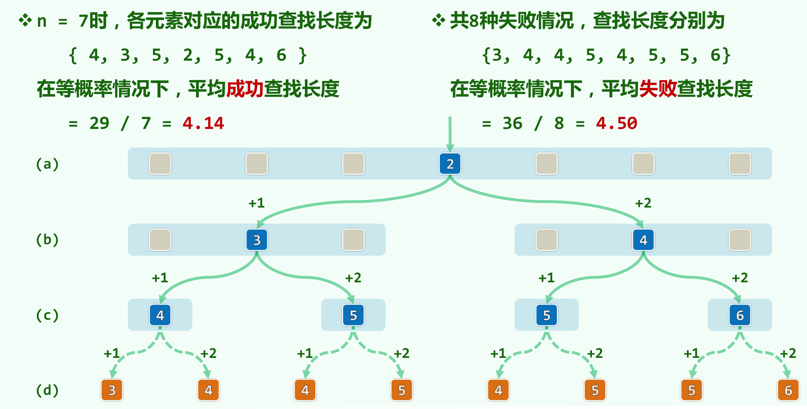

# 2. 向量
## 2.1 抽象数据类型
### 2.1.1 接口与实现
- 抽象数据类型 = 数据模型 + 定义在模型上的一组操作
    &emsp;&emsp;&emsp;&emsp;&emsp;&emsp;&emsp;抽象定义&emsp;外部的逻辑特性&emsp;&emsp;&emsp;&emsp;操作&语义
    &emsp;&emsp;&emsp;&emsp;&emsp;&emsp;&emsp;一种定义&emsp;不考虑时间复杂度&emsp;&emsp;&emsp;不涉及数据的存储方式
- 数据结构 = 基于某种特定语言，实现ADT的一整套算法
    &emsp;&emsp;&emsp;&emsp;&emsp;&emsp;&emsp;具体实现&emsp;内部的表示与实现&emsp;&emsp;&emsp;&emsp;完整的算法
    &emsp;&emsp;&emsp;&emsp;&emsp;&emsp;&emsp;多种实现&emsp;与复杂度密切相关&emsp;&emsp;&emsp;&emsp;要考虑数据的具体存储机制
- 在数据结构的**具体实现**与**实际应用**之间，ADT就分工与接口制定了的规范
  - 实现：**高效**兑现数据结构的ADT接口操作
  - 应用：便捷的通过操作接口使用数据结构
- 按照ADT规范
  - 高层 **算法设计**者与底层 **数据结构实现者**可高效的分工协作
  - 不同的算法与数据结构可以 **便捷组合**
  - 每种操作接口只需统一的实现一次，代码篇幅缩短，软件 **复用**度提高
### 2.1.2 从数组到向量
- 循秩访问
  - C/C++中，数组元素与编号一一对应
  - 元素由**编号**唯一指代，并可 **直接访问** //故亦称作线性数组
- 向量：向量是数组的 **抽象**与 **泛化**，由一组元素按线性次序封装而成
  - 各元素与[0,n)内的秩(rank)一一对应：using Rank = int Rank；
  - 操作、管理维护更加简化、统一与安全
  - 元素类型可灵活选取，便于定义复杂数据结构 //Vector<PFCTree*>pfcForest
- 向量ADT接口

操作|功能|适用对象
:---:|:---:|:---:
size()|报告向量当前的规模(元素总数)|向量
get(r)|获取秩为r的元素|向量
put(r,e)|用e替换秩为r的元素的数值|向量
insert(r,e)|e作为秩为r元素插入，原后继依次后移|向量
remove(r)|删除秩为r的元素，返回该元素原值|向量
disordered()|判断所有的元素是否已按非降序排列|向量
sort()|调整二元素的位置，使之按非降序排列|向量
find(e)|查找目标元素e|向量
search(e)|查找e，返回不大于e且秩最大的元素|有序向量
deduplicate(),uniquify()|删除重复元素|向量/有序向量
traverse()|遍历响亮并同意处理所有元素|向量
- [STL VECTOR样例程序](course/vector_example.cpp)
### 2.1.3 模板类

- [构造+析构：重载程序](course/Vector/Vector.h)
## 2.2 可扩充向量
### 2.2.1 算法
- 静态空间管理
  - 开辟内部数组_elem[]并使用一段连续的物理空间
    - _capacity 总容量
    - _size 当前实际规模n
  - 静态空间策略，容量_capacity固定，有明显缺陷
    - 上溢/overflow：_elem[]不足以存放所有元素，尽管系统空间充足
    - 下溢/underflow:_elem[]元素廖廖无几，浪费存储空间
      **装填因子**/ load factor:$\lambda = \_size/\_capacity << 50\%$
  - 一般应用环境，难以准确 **预测**空间的需求量
- 动态空间管理
  - 在即将上溢时，**适当扩大**内部数组的容量
  - [扩容算法](course/Vector/Vector.h)
### 2.2.2 分摊
- 容量递增策略
  - 追加固定容量： _elem = new_T[_capacity += INCREMENT];
  - 最坏情况： 在初始容量0的**空**向量中，连续插入n = m * I && n >> 2个元素，**无删除**操作。
  - 在第1、I+1、2I+1...次插入时，都需要扩容。
  - 即使不计申请空间操作，扩容复制原向量的成本依次为：
    0, I，2I，...(m-1)I   //算数级数
    总体耗时O(n^2),每次(insert/remove)的**分摊成本**为O(n)
- 容量加倍策略
  - 容量加倍： _elem = new T[_capacity <<= 1];
  - 最坏情况：在初始容量为**1**的 **满** 向量中，连续插入 n = 2^m && n >> 2个元素，而 **无删除** 操作
  - 在第1、2、4、8、...次插入时，都需要扩容
  - 各次扩容过程中复制原向量的成本依次为
    1,2,4,...2^m-1,2^m = n  //几何级数
    总体耗时O(n),每次(insert/remove)操作的**分摊成本**为O(1)
- 对比

指标|递增策略|倍增策略
:---:|:---:|:---:
累计 扩容时间|O(n^2)|O(n)
分摊 扩容时间|O(n)|O(1)
空间利用率 (装填因子)|≈100%|>50%
- 平均分析vs分摊分析
  - 平均(average complexity)：根据各种操作出现的概率，将对应的成本加权平均
    - 各种可能的操作，作为 **独立事件** 分别考察
    - 割裂了操作之间的 **相关** 性和 **连贯性**
    - 往往 **不能准确** 评判数据结构和算法的真实性能
  - 分摊(amortized complexity)：**连续** 实施 **足够多** 次操作，所需 **总体** 成本摊还至 **单次** 操作
    - 从实际可行的角度，对一系列操作做整体的考量
    - 更加 **忠实** 地刻画了可能出现的操作序列
    - 更为 **精准** 地评判数据结构和算法的真实性能

## 2.3 无序向量
### 2.3.1 基本操作
- [元素访问](course/Vector/Vector.h)
  - V.get(r)和V.put(r,2)不够便捷、直观。通过 **重载** 下标操作符"[]"实现
  - 重载运算符的返回值为引用，这样可以实现元素赋值操作
  - 这里采用了简易的方式处理意外和错误(入口参数约定：0 <= r < _size)
  - 实际应用中，应采用更为严格的方式
- [插入操作](course/Vector/Vector.h)
- [区间删除](course/Vector/Vector.h)
- [单元素删除](course/Vector/Vector.h)
  - 将 **单元素** 视作 **区间** 的特例
  - 但不能反过来，通过反复调用remove(r)来实现remove(lo,hi):
    - 每次循环耗时 n-hi = O(n);
    - 循环次数 hi-lo = O(n);
    - 这样将导致时间复杂度为O(n^2);
### 2.3.2 查找
- 对于无序向量，只需要判等器
- 对于有序向量，需要比较器
- [顺序查找](course/Vector/Vector.h)
  - 输入敏感(input-sensitive):最好O(1)，最差O(n)
### 2.3.3 去重
- [去重](course/Vector/Vector.h)
  - 可以从不变性和单调性证明算法的正确性
    - 不变性：[0,i)内没有重复元素
    - 单调性：i增大，直至_size，问题规模不断缩小
### 2.3.4 遍历
- 对于向量中的每一元素，统一实施visit()操作 //如何指定visit()?如何将其传递到向量内部？
- 有两种方式，一种是使用函数指针，另一种是使用函数对象
  - 函数指针，只读或者局部性修改
  - 函数对象，全局性修改更便捷
  - 函数对象实例：统一地将向量的元素分别 **加一**，只需
    - 实现一个可以单个T类型元素加一的类(结构)
      template <typename T>   // 假设T可直接递增或已重载"++"
      struct Increase     // 函数对象：通过重载()实现
      { virtual void operator()(T & e) {e++;} };
    - 将其作为参数传递给遍历算法
      template <typename T>
      void increase(Vector<T> & V)
      { V.traverse(Increase<T>());} // 即可以使之作为基本操作，遍历向量
## 2.4 有序向量
### 2.4.1 唯一化
- 有序性及其甄别
  - 起泡排序原理：有序/无序序列中，任何/总有一对 **相邻元素** 顺序/逆序
  - 因此，相邻逆序对数目，可在一定程度上 **度量** 向量的 **紊乱** 程度
  - [disordered()](course/Vector/Vector.h)
  - 无序向量经 **预处理** 转换为有序向量之后，算法多可优化。
- 去重算法
  - 若采用无序向量的去重算法，会相当低效(O(n^2))。
  - [高效去重法uniquify()](course/Vector/Vector.h)
### 2.4.2 二分查找(版本A)
- 统一接口
  - 对于特殊情况的处理：
    - 目标元素不存在
    - 同时存在多个
- 有序向量中，每个元素都是 **轴点**
  - 以任一元素为界，可以将待查找区间分为三部分
- 减而治之
  将目标元素e与轴点处元素x作比较：
  - e < x:则e必存在轴点左侧子区间，故可递归左侧子区间
  - x < e:则e必在轴点右侧字却见，故递归右侧子区间
  - e = x：在此处命中，可随即返回 // 若有多个，返回何者
  将轴点mi取做中点，则至多经过两次比较，要么命中，要么将问题规模缩减一半
- 实现 [binSearch()](course/binSearch.cpp)
- 查找长度
  - 如何更精确的评估查找算法的性能？考察关键码的比较次数
  - 通常，需分别针对 **成功** 与 **失败**查找，从 **最好、最坏、平均** 等角度评估
  - 上述二分法，成功、失败时的平均长度均大致为O(1.50×logn)
  - 以n=7时为例：
    
### 2.4.3 Fibnacci查找
- 思路及原理
  - 版本A：转向左右分支的关键码 **比较次数** 不等，而 **递归深度**却相同
  - 通过对 **递归深度** 的不均衡对 **转向成本** 的不均衡做 **补偿**， 平均查找深度能进一步缩短
  - 若有 n = fib(k) - 1，则可取mi = fib(k-1) - 1
    于是，前后子向量的长度分别为 fib(k-1) - 1和fib(k-2) - 1
- 实现
## 2.5 起泡排序
## 2.6 归并排序
## 2.7 位图