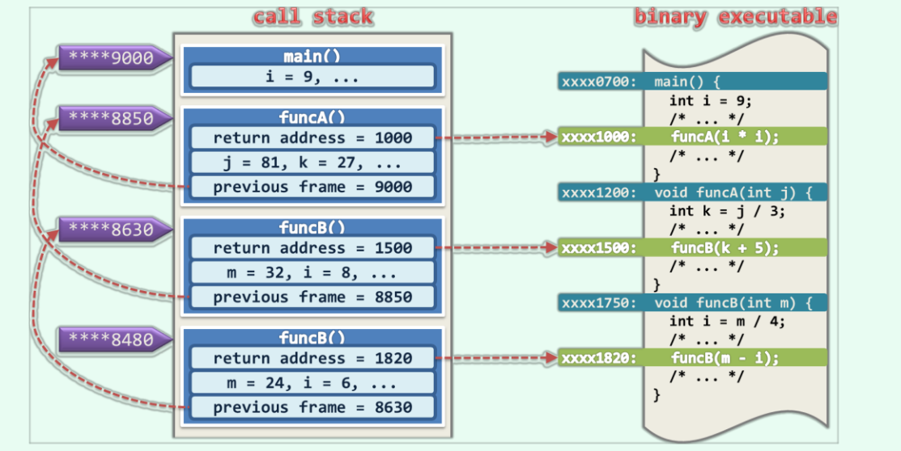

# 4. 栈与队列
栈与队列的数据操作范围仅限于逻辑上的特定某端。
信息处理领域，PostScript或者Java，实时运行的环境都是基于栈的虚拟机。
队列适用于需要公平且经济的对资源做管理或分配的场合。
## 4.1 栈
### 4.1.1 ADT接口
- 入栈与出栈
  栈禁止擦欧洲哦的一端成为盲端。

|操作接口|功能|
|---:|:---|
|size()|报告栈的规模|
|empty()|判断栈是否为空|
|top()|**引用**栈顶对象|
|pop()|删除栈顶对象|
|push(e)|将e插至栈顶|

- 后进先出LIFO
### 4.1.2 Stack模板类
- [基于Vector实现的Stack类](code/Stack/Stack_vector.h)
- [基于List实现的Stack类](code/Stack/Stack_List.h)

### 4.2 栈与递归
### 4.2.1 函数调用栈

在大部分操作系统中，每个运行中的二进制程序都配有一个调用栈获执行栈。
- 函数调用
  调用栈的基本单位是帧(frame)，每次函数调用时，都会相应的创建一帧，记录该函数实例在二进制程序中的"返回地址"，"局部变量"，"传入参数等"，并将该帧压入调用栈。
- 递归
  递归时会创建函数的多个实例，这些实例在调用栈中各自占有一帧。
### 4.2.2 避免递归
很多高级程序设计语言几乎都允许函数直接或间接地自我调用，通过递归来提高代码的简洁度和可读性。
在追求效率的场合，应该尽可能的避免递归，尤其是过度的递归，将递归改为迭代。
## 4.3 栈的典型应用
### 4.3.1 逆序输出
这一类问题的特征：算法确定，解答以线性序列的形式给出，通常序列以逆序输出的，并且输入输出规模不确定。
- [进制转换递归版](code/conversion_recursive/convert.cpp)
- [进制转换迭代版](code/conversion/convert.cpp)

### 4.3.2 递归嵌套
具有自相似性的问题多可嵌套的递归描述。
- 栈混洗
  栈A有n个元素，通过栈S将A中的元素全部转移到B中，得到的新序列成为栈混洗。
- 括号匹配
  括号匹配的检查是语法检查中必须的一个环节。
  - [递归实现](code/nest_recursive/nest.cpp)
    最坏情况下divide()需要线性时间，递归深度为O(n),故以上算法共需O(n^2)时间。
  - [迭代实现](code/next_stack/nest.cpp)
### 4.3.3 延迟缓冲
  在一些应用问题中，输入可分解为多个单元并通过迭代一次扫描处理，**但计算往往会滞后于扫描的进度**，在这类场合中，栈结构这可以扮演数据缓冲区的角色。
- 表达式求值
  运算符不能简单的按照先左后右的次序执行表达式的运算符。
- [优先级表](code/RPN/priority.h)
  为了统一算法的处理流程，将左、右括号以及标识表达式尾部的字符'\0'，也视作运算符。
- [求值算法](code/RPN/RPN.cpp)

### 4.3.4 逆波兰表达式